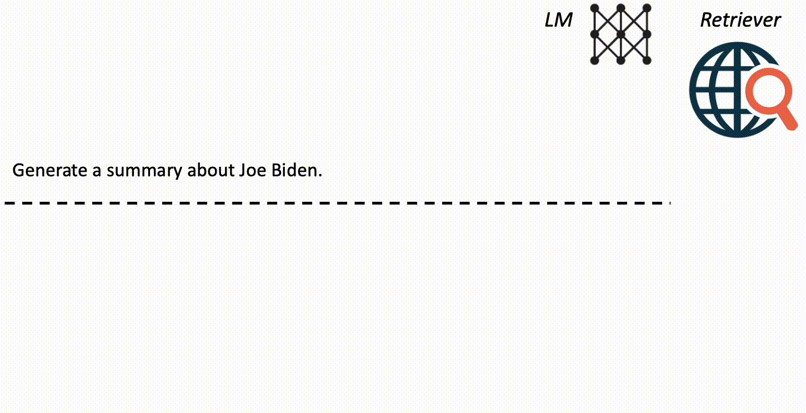

# <ins>F</ins>orward-<ins>L</ins>ooking <ins>A</ins>ctive <ins>RE</ins>trieval augmented generation (FLARE)

This repository contains the code and data for the paper
[Active Retrieval Augmented Generation](https://arxiv.org/abs/2305.06983).
This repository was forked from [Flare](https://github.com/jzbjyb/FLARE/tree/main)

## Overview

FLARE is a generic retrieval-augmented generation method that actively decides when and what to retrieve using a prediction of the upcoming sentence to anticipate future content and utilize it as the query to retrieve relevant documents if it contains low-confidence tokens.

<p align="center">
  
</p>

## Install environment with Conda
Create a conda env and follow `setup.sh` to install dependencies.

## Quick start

### Download Wikipedia dump
Download the Wikipedia dump from [the DPR repository](https://github.com/facebookresearch/DPR/blob/main/dpr/data/download_data.py#L32) using the following command:
```shell
mkdir data/dpr
wget -O data/dpr/psgs_w100.tsv.gz https://dl.fbaipublicfiles.com/dpr/wikipedia_split/psgs_w100.tsv.gz
pushd data/dpr
gzip -d psgs_w100.tsv.gz
popd
```

### Build Wikipedia index
We use Elasticsearch to index the Wikipedia dump.
```shell
wget -O elasticsearch-7.17.9.tar.gz https://artifacts.elastic.co/downloads/elasticsearch/elasticsearch-7.17.9-linux-x86_64.tar.gz  # download Elasticsearch
tar zxvf elasticsearch-7.17.9.tar.gz
pushd elasticsearch-7.17.9
nohup bin/elasticsearch &  # run Elasticsearch in background
popd
python prep.py --task build_elasticsearch --inp data/dpr/psgs_w100.tsv wikipedia_dpr  # build index
```

### Setting up the HuggingFace API key
Add your HuggingFace API key to the `.bashrc` file by executing the following command:
```shell
vim ~/.bashrc
```
Inside the file, assign your key to the HF_token environment variable as shown below:
```
export HF_token="your_key_here"
```
Save the changes and reload your `.bashrc` by running:
```shell
source ~/.bashrc
```
### Experiment Configuration
The following parameters can be modified to control the experimental setup:
**In `configs/2wikihop_flare_config.json`:**
- `topk`: The number of documents to retrieve upon triggering retrieval.
- `use_ctx`: If set to `false`, no retrieved documents are included. Instead, the prompt consists only of the exemplar questions and answers, along with the current question.
- `look_ahead_filter_prob`: Probability threshold for triggering retrieval.
- `look_ahead_mask_prob`: Probability threshold for masking tokens with low confidence.
**In `openai.sh`:**
- `debug`: Set `true` to active the debugging mode which walks you through the iterative retrieval and generation process one example at a time.
- `model`: Specify the model name (e.g., `llama3.1-8b-i`).
- `fewshot`(under 2wikihop dataset): Number of few-shot exemplars to use.
- `max_generation_len`(under 2wikihop dataset): Maximum length of generated outputs.
- `max_num_examples`(under debug): Modify the value to run small-scale experiments.

If you would like to run the experiment with xLSTM, you have to install a specific version of transformers which is mentioned in the `setup.sh` (that version is not compatible with the Gemma model).

### Run FLARE
```shell
./openai.sh 2wikihop configs/2wikihop_flare_config.json  # 2WikiMultihopQA dataset
```
## Citation
```
@article{jiang2023flare,
      title={Active Retrieval Augmented Generation}, 
      author={Zhengbao Jiang and Frank F. Xu and Luyu Gao and Zhiqing Sun and Qian Liu and Jane Dwivedi-Yu and Yiming Yang and Jamie Callan and Graham Neubig},
      year={2023},
      eprint={2305.06983},
      archivePrefix={arXiv},
      primaryClass={cs.CL}
}
```
